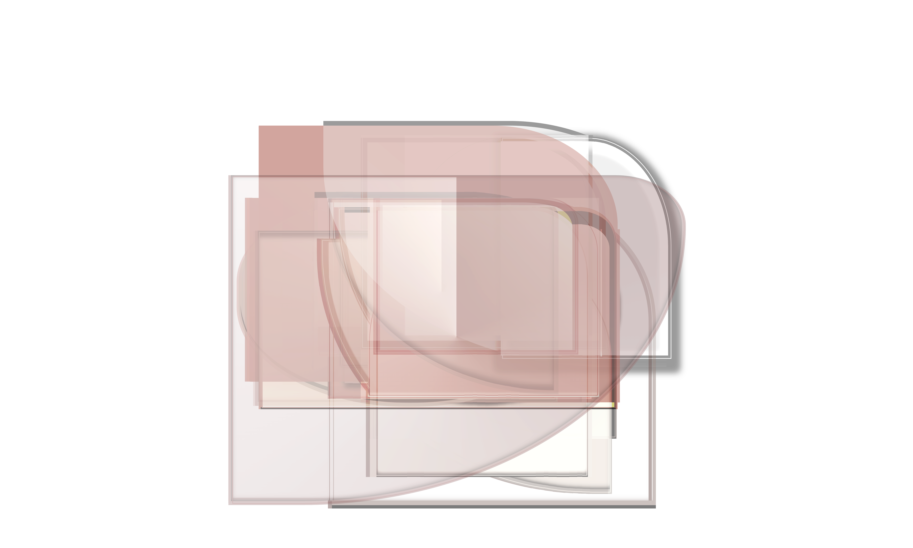
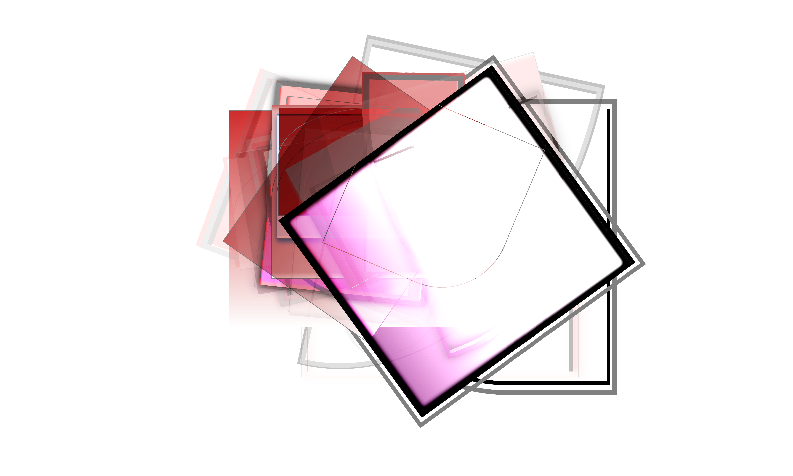
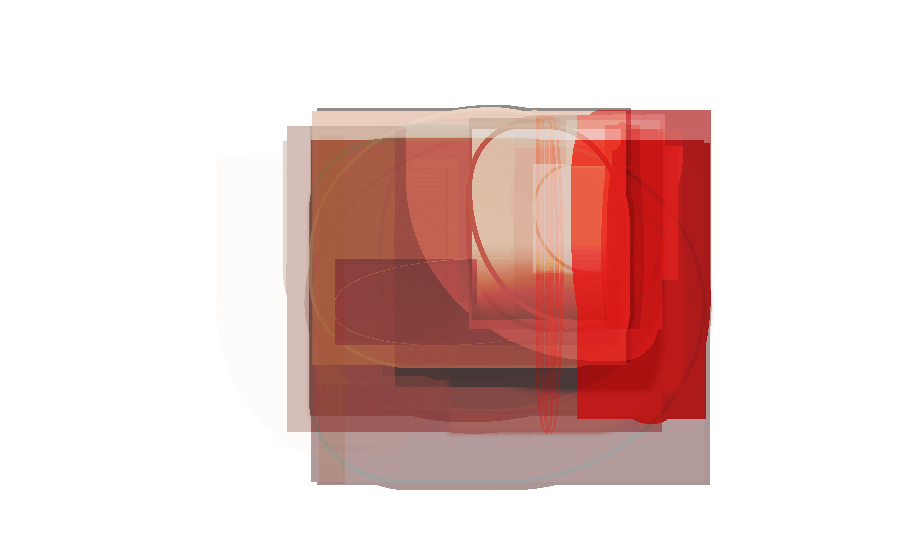

# Filterx-TUI (WIP)
Generative design tool with a terminal UI — compose layouts, render to canvas, export to SVG/PDF. Lorem ipsum dolor sit amet, consetetur sadipscing elitr, sed diam nonumy eirmod tempor invidunt ut labore et dolore magna aliquyam erat, sed diam voluptua. At vero eos et accusam et justo duo dolores et ea rebum. Stet clita kasd gubergren, no sea takimata sanctus est Lorem ipsum dolor sit amet. Lorem ipsum dolor sit amet, consetetur sadipscing elitr, sed diam nonumy eirmod tempor invidunt ut labore et dolore magna aliquyam erat, sed diam voluptua. At vero eos et accusam et justo duo dolores et ea rebum. Stet clita kasd gubergren, no sea takimata sanctus est Lorem ipsum dolor sit amet.

[Installation](#installation) / 
[Configuration](#configuration) / 
[API Reference](#reference) / 
[API Credit](#credit) / 
[Gallery](#gallery)


(Drag Video in here). Lorem ipsum dolor sit amet, consetetur sadipscing elitr, sed diam nonumy eirmod tempor invidunt ut labore et dolore magna aliquyam erat, sed diam voluptua. At vero eos et accusam et justo duo dolores et ea rebum. Stet clita kasd gubergren, no sea takimata sanctus est Lorem ipsum dolor sit amet. Lorem ipsum dolor sit amet, consetetur sadipscing elitr, sed diam nonumy eirmod tempor invidunt ut labore et dolore magna aliquyam erat, sed diam voluptua. At vero eos et accusam et justo duo dolores et ea rebum. Stet clita kasd gubergren, no sea takimata sanctus est Lorem ipsum dolor sit amet.

## Installation
Lorem ipsum dolor sit amet, consetetur sadipscing elitr, sed diam nonumy eirmod tempor invidunt ut labore et dolore magna aliquyam erat, sed diam voluptua. At vero eos et accusam et justo duo dolores et ea rebum.

### Generic Install (Native)
Lorem ipsum dolor sit amet, consetetur sadipscing elitr, sed diam nonumy eirmod tempor invidunt ut labore et dolore magna aliquyam erat, sed diam voluptua

```bash
curl -fsSL https://raw.githubusercontent.com/\
andri-berger/filterx-tui/main/install.sh | sh
```

### macOS (Homebrew)
Lorem ipsum dolor sit amet, consetetur sadipscing elitr, sed diam nonumy eirmod tempor invidunt ut labore et dolore magna aliquyam erat, sed diam voluptua

```bash
brew install andri-berger/filterx-tui/tap
```

### Arch Linux (AUR)
Lorem ipsum dolor sit amet, consetetur sadipscing elitr, sed diam nonumy eirmod tempor invidunt ut labore et dolore magna aliquyam erat, sed diam voluptua

```bash
yay -S filterx-tui 
# paru -S filterx-tui
```

## Configuration
Lorem ipsum dolor sit amet, consetetur sadipscing elitr, sed diam nonumy eirmod tempor invidunt ut labore et dolore magna aliquyam erat, sed diam voluptua. At vero eos et accusam et justo duo dolores et ea rebum.

```bash
filterx-tui #Launches the TUI
```
Keyboard-driven, no mouse. Lorem ipsum dolor sit amet, consetetur sadipscing elitr, sed diam nonumy eirmod tempor invidunt ut labore et dolore magna aliquyam erat, sed diam voluptua. At vero eos et accusam et justo duo dolores et ea rebum.

## API Reference
Lorem ipsum dolor sit amet, consetetur sadipscing elitr, sed diam nonumy eirmod tempor invidunt ut labore et dolore magna aliquyam erat, sed diam voluptua. At vero eos et accusam et justo duo dolores et ea rebum.

<table>
    <tr>
        <th align="left">Key</th>
        <th align="left">Binding</th>
        <th align="left">Description</th>
    </tr>
    <tr>
        <td><kbd>
        F1</kbd></td>
        <td>Delete</td>
        <td>Delete table/grid cell. Think of it as DEL or BACKSPACE in a spreadsheet. </td>
    </tr>
    <tr>
        <td><kbd>
        F2</kbd></td>
        <td>Copy</td>
        <td>Delete table/grid cell. Think of it as Ctrl-C in a spreadsheet. </td>
    </tr>
    <tr>
        <td><kbd>
        F3</kbd></td>
        <td>Cut</td>
        <td>Delete table/grid cell. Think of it as Ctrl-C in a spreadsheet. </td>
    </tr>
    <tr>
        <td><kbd>
        F4</kbd></td>
        <td>Paste</td>
        <td>Delete table/grid cell. Think of it as Ctrl-V in a spreadsheet. </td>
    </tr>
    <tr>
        <td><kbd>
        F5</kbd></td>
        <td>Clear</td>
        <td>Clear the Canvas. Lorem ipsum dolor sit amet.</td>
    </tr>
    <tr>
        <td><kbd>
        F6</kbd></td>
        <td>Afs</td>
        <td>Set Seed for A00-A99 Elements. Lorem ipsum dolor sit amet.</td>
    </tr>
    <tr>
        <td><kbd>
        F7</kbd></td>
        <td>Bfs</td>
        <td>Set Seed for B00-B99. Lorem ipsum dolor sit amet.</td>
    </tr>
    <tr>
        <td><kbd>
        F8</kbd></td>
        <td>Cfs</td>
        <td>Set Seed for C00-C99. Lorem ipsum dolor sit amet.</td>
    </tr>
    <tr>
        <td><kbd>F9</kbd></td>
        <td>Create</td>
        <td>Generate Artwork via Random Generator. Lorem ipsum dolor sit amet.</td>
    </tr>
    <tr>
        <td><kbd>F10</kbd></td>
        <td>Export</td>
        <td>Export both generated (png) and project file (json) into the directory from where the app was executed / started.</td>
    </tr>
    <tr>
        <td><kbd>
        Tab</kbd></td>
        <td>Navigate</td>
        <td>Cycle forward all navigational UI-Elements. Lorem ipsum dolor sit amet, consetetur sadipscing elitr, sed diam nonumy eirmod tempor invidunt ut labore et dolore magna aliquyam erat.</td>
    </tr>
    <tr>
        <td><kbd>
        Shift-Tab</kbd></td>
        <td>Navigate</td>
        <td>Cycle backward all navigational UI-Elements. Lorem ipsum dolor sit amet, consetetur sadipscing elitr, sed diam nonumy eirmod tempor invidunt ut labore et dolore magna aliquyam erat.</td>
    </tr>
    <tr>
        <td><kbd>
        Arrow-keys</kbd></td>
        <td>Navigation</td>
        <td>Navigate table/grid cells in all directions, left, right, top, bottom. Lorem ipsum dolor sit amet, consetetur sadipscing elitr, sed diam nonumy eirmod tempor invidunt ut labore et dolore magna aliquyam erat.</td>
    </tr>
    <tr>
        <td><kbd>
        BackSpace</kbd></td>
        <td>Navigation</td>
        <td>Lorem ipsum dolor sit amet, consetetur sadipscing elitr, sed diam nonumy eirmod tempor invidunt ut labore et dolore magna aliquyam erat.</td>
    </tr>
    <tr>
        <td><kbd>
        Space</kbd></td>
        <td>Navigation</td>
        <td>Lorem ipsum dolor sit amet, consetetur sadipscing elitr, sed diam nonumy eirmod tempor invidunt ut labore et dolore magna aliquyam erat.</td>
    </tr>
    <tr>
        <td><kbd>
        Enter</kbd></td>
        <td>Navigation</td>
        <td>Lorem ipsum dolor sit amet, consetetur sadipscing elitr, sed diam nonumy eirmod tempor invidunt ut labore et dolore magna aliquyam erat.</td>
    </tr>
    <tr>
        <td><kbd>
        Ctrl-Q</kbd></td>
        <td>System</td>
        <td>Exit the app. Lorem ipsum dolor sit amet, consetetur sadipscing elitr, sed diam nonumy eirmod tempor invidunt ut labore et dolore magna aliquyam erat.</td>
    </tr>
</table>


## API Credit
Lorem ipsum dolor sit amet, consetetur sadipscing elitr, sed diam nonumy eirmod tempor invidunt ut labore et dolore magna aliquyam erat, sed diam voluptua. At vero eos et accusam et justo duo dolores et ea rebum.

<table width="100%">
    <tr>
        <th align="left">Layer</th>
        <th align="left">Name</th>
        <th align="left">
        Link </th>
    </tr>
        <tr><td><kbd>
        Build</kbd></td>
        <td>Apng</td><td>
        <a href="//github.com/apngasm/apngasm">
        https://github.com/apngasm/apng</a></td>
    </tr>
    <tr>
        <td><kbd>
        Build</kbd></td>
        <td>Watch</td><td>
        <a href="//github.com/samuelcolvin/watchfiles">
        https://github.com/samuelcolvin</a></td>
    </tr>
    <tr>
        <td><kbd>
        Utility</kbd></td>
        <td>Pip Uv</td><td>
        <a href="//github.com/astral-sh/uv">
        https://github.com/astral-sh/uv</a></td>
    </tr>
    <tr>
        <td><kbd>
        Framework</kbd></td>
        <td>Textual</td><td>
        <a href="//github.com/Textualize/textual">
        https://github.com/Textualize/textual</a></td>
    </tr>
    <tr>
        <td><kbd>
        Framework</kbd></td>
        <td>Textual Img</td><td>
        <a href="//github.com/lnqs/textual-image">
        https://github.com/lnqs/textual-image</a></td>
    </tr>
    <tr align="left">
        <td><kbd>
        Processing</kbd></td>
        <td>Resize</td><td>
        <a href="//github.com/shibukawa/imagesize_py">
        https://github.com/shibukawa/imsize</a></td>
    </tr>
    <tr>
        <td><kbd>
        Processing</kbd></td>
        <td>Gmic</td><td>
        <a href="//github.com/GreycLab/gmic">
        https://github.com/GreycLab/gmic</a></td>
    </tr>
</table>

Lorem ipsum dolor sit amet, consetetur sadipscing elitr, sed diam nonumy eirmod tempor invidunt ut labore et dolore magna aliquyam erat, sed diam voluptua. At vero eos et accusam et justo duo dolores et ea rebum. Stet clita kasd gubergren, no sea takimata sanctus est Lorem ipsum dolor sit amet. Lorem ipsum dolor sit amet, consetetur sadipscing elitr, sed diam nonumy eirmod tempor invidunt ut labore et dolore magna aliquyam erat, sed diam voluptua. At vero eos et accusam et justo duo dolores et ea rebum. Stet clita kasd gubergren, no sea takimata sanctus est Lorem ipsum dolor sit amet.

## API Gallery
Lorem ipsum dolor sit amet, consetetur sadipscing elitr, sed diam nonumy eirmod tempor invidunt ut labore et dolore magna aliquyam erat, sed diam voluptua. At vero eos et accusam et justo duo dolores et ea rebum. Stet clita kasd gubergren, no sea takimata sanctus est Lorem ipsum dolor sit amet. Lorem ipsum dolor sit amet, consetetur sadipscing elitr, sed diam nonumy eirmod tempor invidunt ut labore et dolore magna aliquyam erat, sed diam voluptua. At vero eos et accusam et justo duo dolores et ea rebum. Stet clita kasd gubergren, no sea takimata sanctus est Lorem ipsum dolor sit amet.


<table>
  <tr>
    <td><a href="Backend/module/1744168392.png">
    </a></td>
    <td><a href="Backend/module/1744168389.png">
    </a></td>
    <td><a href="Backend/module/1744168387.png">
    </a></td>
    <td><a href="Backend/module/1744168383.png">
    </a></td>
    <td><a href="Backend/module/1744168379.png">
    </a></td>
    <td><a href="Backend/module/1744168364.png">
    </a></td>
  </tr>
  <tr>
    <td><a href="Backend/module/1744168360.png">
    </a></td>
    <td><a href="Backend/module/1744168357.png">
    </a></td>
    <td><a href="Backend/module/1744168352.png">
    </a></td>
    <td><a href="Backend/module/1744168350.png">
    </a></td>
    <td><a href="Backend/module/1744168323.png">
    </a></td>
    <td><a href="Backend/module/1744168321.png">
    </a></td>
  </tr>
  <tr>
    <td><a href="Backend/module/1744168314.png">
    </a></td>
    <td><a href="Backend/module/1744168305.png">
    </a></td>
    <td><a href="Backend/module/1744168298.png">
    </a></td>
    <td><a href="Backend/module/1744168282.png">
    </a></td>
    <td><a href="Backend/module/1744168280.png">
    </a></td>
    <td><a href="Backend/module/1744168271.png">
    </a></td>
  </tr>
  <tr>
    <td><a href="Backend/module/1744168261.png">
    </a></td>
    <td><a href="Backend/module/1744168246.png">
    </a></td>
    <td><a href="Backend/module/1744168243.png">
    </a></td>
    <td><a href="Backend/module/1744168233.png">
    </a></td>
    <td><a href="Backend/module/1744168209.png">
    </a></td>
    <td><a href="Backend/module/1744168199.png">
    </a></td>
  </tr>
  <tr>
    <td><a href="Backend/module/1744168196.png">
    </a></td>
    <td><a href="Backend/module/1744168190.png">
    </a></td>
    <td><a href="Backend/module/1744168164.png">
    </a></td>
    <td><a href="Backend/module/1744168146.png">
    </a></td>
    <td><a href="Backend/module/1744168006.png">
    </a></td>
    <td><a href="Backend/module/1744167993.png">
    </a></td>
  </tr>
  <tr>
    <td><a href="Backend/module/1744167990.png">
    </a></td>
    <td><a href="Backend/module/1744167985.png">
    </a></td>
    <td><a href="Backend/module/1744167983.png">
    </a></td>
    <td><a href="Backend/module/1744167978.png">
    </a></td>
    <td><a href="Backend/module/1744167972.png">
    </a></td>
    <td><a href="Backend/module/1744167951.png">
    </a></td>
  </tr>
</table>

Lorem ipsum dolor sit amet, consetetur sadipscing elitr, sed diam nonumy eirmod tempor invidunt ut labore et dolore magna aliquyam erat, sed diam voluptua. At vero eos et accusam et justo duo dolores et ea rebum.


## Rationale

If you encounter any issues, please file an issue on GitHub.
<br>If you find this module useful, please consider starring the repository on GitHub. 

This project began by moving most of the functionality from a commercial WEB SaaS-project https://print-artwork.com (minus the physical print / POD, minus the vectorizer => vtracer), free of charge, now at the complete opposite in copyleft territory, with some additional code-tweaks to accommodate the different UI-requirements in archaic TUI-land as opposed to shiny WEB-land. The app has been split up into the the glaze/gloss part and the generational part with its sibling <a href="https://github.com/andri-berger/artwork-tui>filterx-TUI">filterx-TUI</a> listed under the same GitHub Profile. Thus, they complement each another really well. The other one for the substance, the matter, this one for the refinement.

<br>
<br>
<br>

