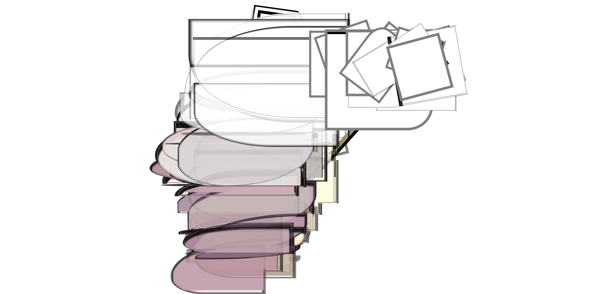
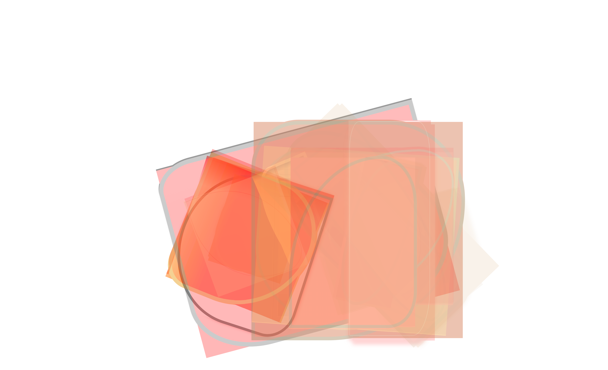
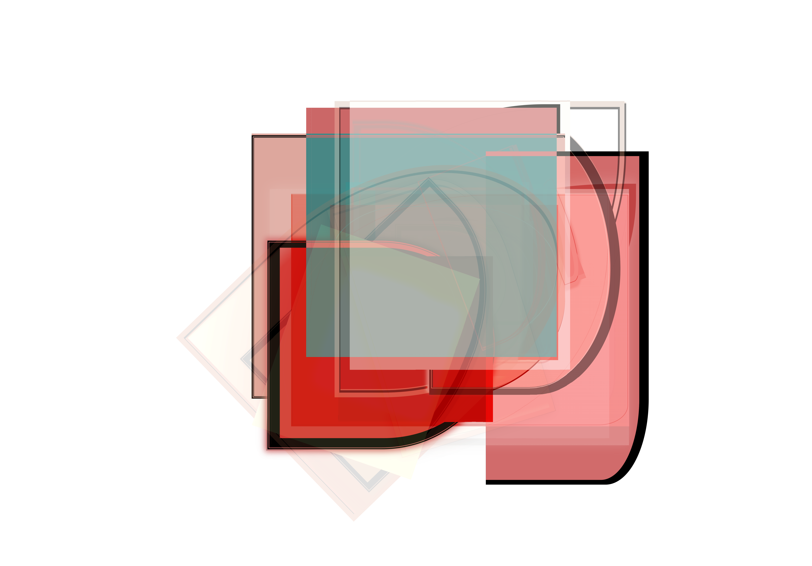
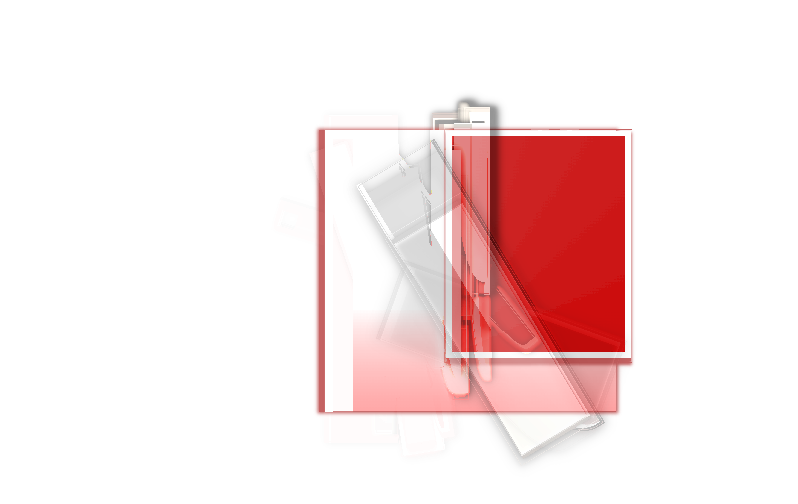
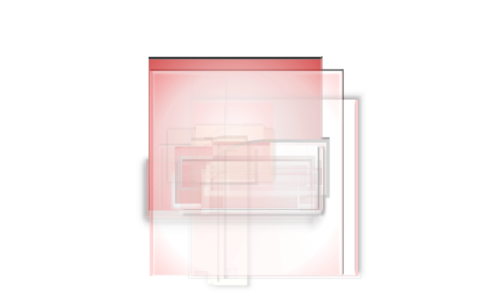
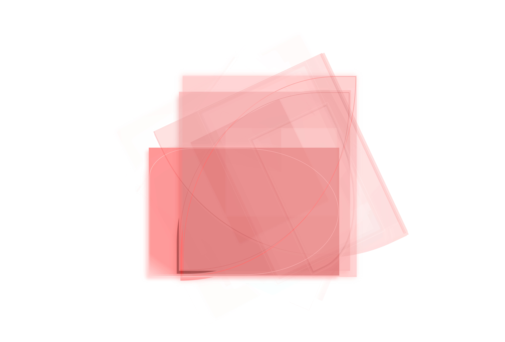
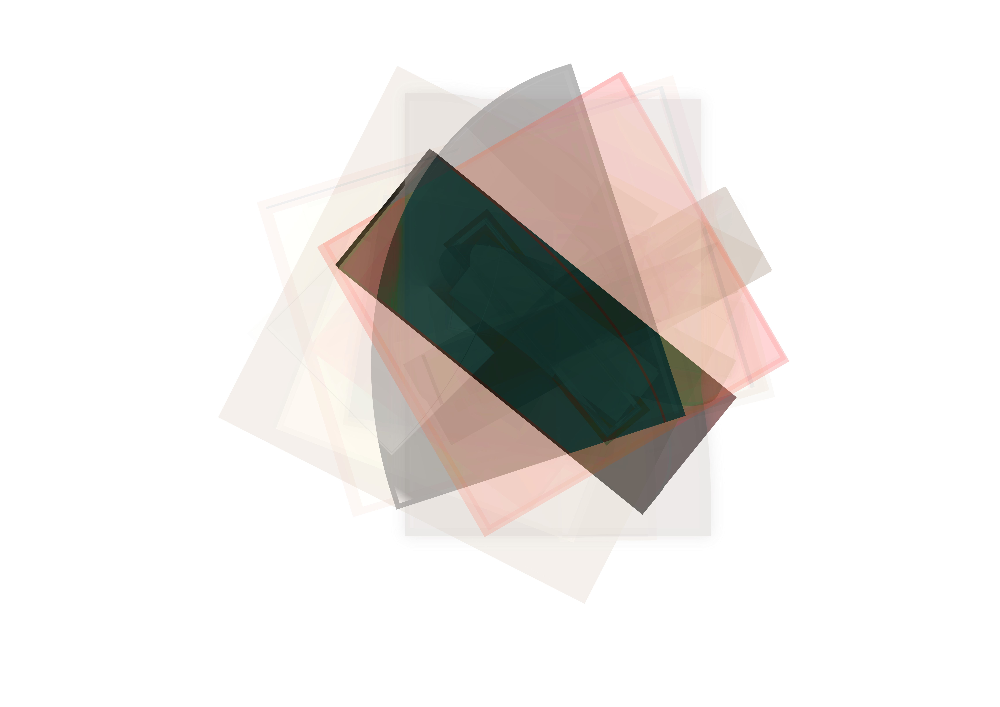
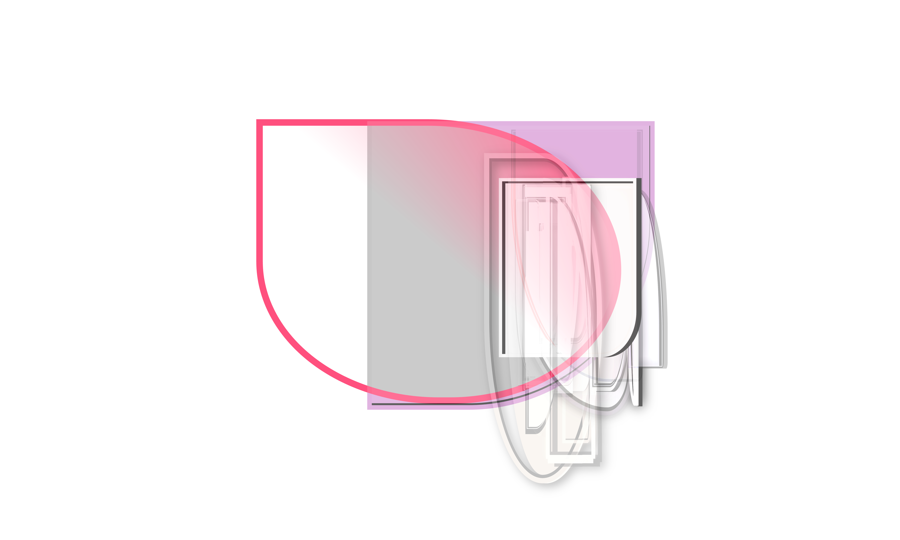

# Filterx-TUI (WIP)
Generative design tool with a terminal UI — compose layouts, render to canvas, export to SVG/PDF. Lorem ipsum dolor sit amet, consetetur sadipscing elitr, sed diam nonumy eirmod tempor invidunt ut labore et dolore magna aliquyam erat, sed diam voluptua. At vero eos et accusam et justo duo dolores et ea rebum. Stet clita kasd gubergren, no sea takimata sanctus est Lorem ipsum dolor sit amet. Lorem ipsum dolor sit amet, consetetur sadipscing elitr, sed diam nonumy eirmod tempor invidunt ut labore et dolore magna aliquyam erat, sed diam voluptua. At vero eos et accusam et justo duo dolores et ea rebum. Stet clita kasd gubergren, no sea takimata sanctus est Lorem ipsum dolor sit amet.

[Features](#features) / 
[Installation](#installation) / 
[Configuration](#configuration) / 
[API Reference](#reference) / 
[API Credit](#credit) / 
[Gallery](#gallery)


## Features
(Drag Video in here). Lorem ipsum dolor sit amet, consetetur sadipscing elitr, sed diam nonumy eirmod tempor invidunt ut labore et dolore magna aliquyam erat, sed diam voluptua. At vero eos et accusam et justo duo dolores et ea rebum. Stet clita kasd gubergren, no sea takimata sanctus est Lorem ipsum dolor sit amet. Lorem ipsum dolor sit amet, consetetur sadipscing elitr, sed diam nonumy eirmod tempor invidunt ut labore et dolore magna aliquyam erat, sed diam voluptua. At vero eos et accusam et justo duo dolores et ea rebum. Stet clita kasd gubergren, no sea takimata sanctus est Lorem ipsum dolor sit amet.


## Installation
Lorem ipsum dolor sit amet, consetetur sadipscing elitr, sed diam nonumy eirmod tempor invidunt ut labore et dolore magna aliquyam erat, sed diam voluptua. At vero eos et accusam et justo duo dolores et ea rebum.

**Generic Install (Native)**
<br>Lorem ipsum dolor sit amet, consetetur sadipscing elitr, sed diam nonumy eirmod tempor invidunt ut labore et dolore magna aliquyam erat, sed diam voluptua
```sh
curl -fsSL https://github.com/andri-berger/filterx-tui/releases@0.0.1 | bash
curl -o https://github.com/andri-berger/filterx-tui/releases@0.0.1 filterx-tui
chmod +x filterx-tui
```
**macOS (Homebrew)**
<br>Lorem ipsum dolor sit amet, consetetur sadipscing elitr, sed diam nonumy eirmod tempor invidunt ut labore et dolore magna aliquyam erat, sed diam voluptua
```sh
brew install andri-berger/tap/filterx-tui
```
```sh
brew install filterx-tui
```
**Arch Linux (AUR)**
<br>Lorem ipsum dolor sit amet, consetetur sadipscing elitr, sed diam nonumy eirmod tempor invidunt ut labore et dolore magna aliquyam erat, sed diam voluptua
```sh
pacman -S filterx-tui
```
```sh
paru -S filterx-tui
```
```sh
yay -S filterx-tui
```

## Configuration
Lorem ipsum dolor sit amet, consetetur sadipscing elitr, sed diam nonumy eirmod tempor invidunt ut labore et dolore magna aliquyam erat, sed diam voluptua. At vero eos et accusam et justo duo dolores et ea rebum.
```sh
filterx-tui
```
Launches the TUI. Keyboard-driven, no mouse. Lorem ipsum dolor sit amet, consetetur sadipscing elitr, sed diam nonumy eirmod tempor invidunt ut labore et dolore magna aliquyam erat, sed diam voluptua. At vero eos et accusam et justo duo dolores et ea rebum.


## API Reference
Lorem ipsum dolor sit amet, consetetur sadipscing elitr, sed diam nonumy eirmod tempor invidunt ut labore et dolore magna aliquyam erat, sed diam voluptua. At vero eos et accusam et justo duo dolores et ea rebum.

<table>
    <tr>
        <th align="left">Docs</th>
        <th align="left">Property</th>
        <th align="left">Resource</th>
        <th align="left">Default</th>
        <th align="left">Description</th>
    </tr>
    <tr>
        <td width="20"><a href="gallery/1744167945.png" target="_blank">
    </a></td>
        <td>writer-org-00</td>
        <td>boolean</td>
        <td>nil</td>
        <td>Enable centering in typing-mode. Lorem ipsum dolor sit amet, consetetur sadipscing elitr, sed diam nonumy eirmod tempor invidunt ut labore et dolore magna aliquyam erat.</td>
    </tr>
    <tr>
        <td width="20"><a href="gallery/1744167945.png" target="_blank">
    </a></td>
        <td>writer-org-01</td>
        <td>boolean</td>
        <td>nil</td>
        <td>Enable anchoring in navigation-mode. Lorem ipsum dolor sit amet.</td>
    </tr>
    <tr>
        <td width="20"><a href="gallery/1744167945.png" target="_blank">
    </a></td>
        <td>writer-org-02</td>
        <td>boolean</td>
        <td>nil</td>
        <td>Enable anchoring in org-mode. Lorem ipsum dolor sit amet.</td>
    </tr>
    <tr>
        <td width="20"><a href="gallery/1744167945.png" target="_blank">
    </a></td>
        <td>writer-org-03</td>
        <td>boolean</td>
        <td>nil</td>
        <td>LTR vs RTL Alignment. Lorem ipsum dolor sit amet.</td>
    </tr>
    <tr>
        <td width="20"><a href="gallery/1744167945.png" target="_blank">
    </a></td>
        <td>writer-org-04</td>
        <td>boolean </td>
        <td>nil</td>
        <td>Centering horizontally. Lorem ipsum dolor sit amet.</td>
    </tr>
    <tr>
        <td width="20"><a href="gallery/1744167945.png" target="_blank">
    </a></td>
        <td>writer-org-05</td>
        <td>integer</td>
        <td>50</td>
        <td>Max-width in chars. Lorem ipsum dolor sit amet.</td>
    </tr>
    <tr>
        <td width="20"><a href="gallery/1744167945.png" target="_blank">
    </a></td>
        <td>writer-org-06</td>
        <td>integer</td>
        <td>0</td>
        <td>Left fringe width in px. Lorem ipsum dolor sit amet.</td>
    </tr>
    <tr>
        <td width="20"><a href="gallery/1744167945.png" target="_blank">
    </a></td>
        <td>writer-org-07</td>
        <td>integer</td>
        <td>0</td>
        <td>Vertical gap at the edge in px. Lorem ipsum dolor sit amet.</td>
    </tr>
    <tr>
        <td width="20"><a href="gallery/1744167945.png" target="_blank">
    </a></td>
        <td>writer-org-08</td>
        <td>integer</td>
        <td>0</td>
        <td>Vertical gap fringe left in px. Lorem ipsum dolor sit amet.</td>
    </tr>
    <tr>
        <td width="20"><a href="gallery/1744167945.png" target="_blank">
    </a></td>
        <td>writer-org-09</td>
        <td>select 0-3</td>
        <td>0</td>
        <td>Line-styles. <br>0 = Lorem ipsum dolor sit amet. <br>1 = Lorem ipsum dolor sit amet. <br>2 = Lorem ipsum dolor sit amet. <br>3 = Lorem ipsum dolor sit amet.</td>
    </tr>
    <tr>
        <td width="20"><a href="gallery/1744167945.png" target="_blank">
    </a></td>
        <td>writer-org-10</td>
        <td>select 0-3</td>
        <td>0</td>
        <td>Hierarchy treshold. <br>0 = Lorem ipsum dolor sit amet. <br>1 = Lorem ipsum dolor sit amet. <br>2 = Lorem ipsum dolor sit amet. <br>3 = Lorem ipsum dolor sit amet.</td>
    </tr>
    <tr>
        <td width="20"><a href="gallery/1744167945.png" target="_blank">
    </a></td>
        <td>writer-org-11</td>
        <td>select 0-3</td>
        <td>0</td>
        <td>Lines config header. <br>0 = Lorem ipsum dolor sit amet. <br>1 = Lorem ipsum dolor sit amet. <br>2 = Lorem ipsum dolor sit amet. <br>3 = Lorem ipsum dolor sit amet.</td>
    </tr>
    <tr>
        <td width="20"><a href="gallery/1744167945.png" target="_blank">
    </a></td>
        <td>writer-org-12</td>
        <td>select 0-3</td>
        <td>0</td>
        <td>Lines config mode. <br>0 = Lorem ipsum dolor sit amet. <br>1 = Lorem ipsum dolor sit amet. <br>2 = Lorem ipsum dolor sit amet. <br>3 = Lorem ipsum dolor sit amet.</td>
    </tr>
    <tr>
        <td width="20"><a href="gallery/1744167945.png" target="_blank">
    </a></td>
        <td>writer-org-13</td>
        <td>select 0-3</td>
        <td>0</td>
        <td>Char/line/word header. <br>0 = Lorem ipsum dolor sit amet. <br>1 = Lorem ipsum dolor sit amet. <br>2 = Lorem ipsum dolor sit amet. <br>3 = Lorem ipsum dolor sit amet.</td>
    </tr>
    <tr>
        <td width="20"><a href="gallery/1744167945.png" target="_blank">
    </a></td>
        <td>writer-org-14</td>
        <td>select 0-3</td>
        <td>0</td>
        <td>Char/line/word mode. <br>0 = Lorem ipsum dolor sit amet. <br>1 = Lorem ipsum dolor sit amet. <br>2 = Lorem ipsum dolor sit amet. <br>3 = Lorem ipsum dolor sit amet.</td>
    </tr>
    <tr>
                <td width="20"><a href="gallery/1744167945.png" target="_blank">
    </a></td>
        <td>writer-org-15</td>
        <td>string</td>
        <td>"/"</td>
        <td>First Separator header / mode. Lorem ipsum dolor sit amet.</td>
    </tr>
    <tr>
        <td width="20"><a href="gallery/1744167945.png" target="_blank">
    </a></td>
        <td>writer-org-16</td>
        <td>string</td>
        <td>" // "</td>
        <td>Second separator header / mode. Lorem ipsum dolor sit amet.</td>
    </tr>
    <tr>
        <td width="20"><a href="gallery/1744167945.png" target="_blank">
    </a></td>
        <td>writer-org-17</td>
        <td>string</td>
        <td>"writer"</td>
        <td>Fallback text if no org-parent. Lorem ipsum dolor sit amet.</td>
    </tr>
    <tr>
        <td width="20"><a href="gallery/1744167945.png" target="_blank">
    </a></td>
        <td>writer-org-18</td>
        <td>value</td>
        <td>'unspecified</td>
        <td>Faces inherit header mode line. Lorem ipsum dolor sit amet.</td>
    </tr>
    <tr>
        <td width="20"><a href="gallery/1744167945.png" target="_blank">
    </a></td>
        <td>writer-org-19</td>
        <td>value</td>
        <td>'unspecified</td>
        <td>Custom face of vertical line. Lorem ipsum dolor sit amet.</td>
    </tr>
</table>


## API Credit
Lorem ipsum dolor sit amet, consetetur sadipscing elitr, sed diam nonumy eirmod tempor invidunt ut labore et dolore magna aliquyam erat, sed diam voluptua. At vero eos et accusam et justo duo dolores et ea rebum.

<table width="100%">
    <tr align="left">
        <th>Layer</th>
        <th>Name</th>
        <th>Link </th>
    </tr>
    <tr align="left">
        <td>Build</td>
        <td>Grip</td>
        <td><a href="//github.com/joeyespo/grip">
        https://github.com/joeyespo/grip</a></td>
    </tr>
    <tr align="left">
        <td>Build</td>
        <td>Biome</td>
        <td><a href="//github.com/biomejs/biome">
        https://github.com/biomejs/biome</a></td>
    </tr>
    <tr align="left">
        <td>Utilities</td>
        <td>Zod Sanitizer</td>
        <td><a href="//github.com/colinhacks/zod">
        https://github.com/colinhacks/zod</a></td>
    </tr>
    <tr align="left">
        <td>Utilities</td>
        <td>Platform</td>
        <td><a href="https://github.com/tox-dev/platformdirs">
        https://github.com/tox-dev/platformdirs</a></td>
    </tr>
    <tr align="left">
        <td>Utilities</td>
        <td>Pydantic</td>
        <td><a href="//github.com/pydantic/pydantic">
        https://github.com/pydantic/pydantic</a></td>
    </tr>
    <tr align="left">
        <td>Utilities</td>
        <td>Pyright</td>
        <td><a href="//github.com/microsoft/pyright">
        https://github.com/microsoft/pyright</a></td>
    </tr>
    <tr align="left">
        <td>Framework</td>
        <td>Numpy</td>
        <td><a href="//github.com/numpy/numpy">
        https://github.com/numpy/numpy</a></td>
    </tr>
    <tr align="left">
        <td>Framework</td>
        <td>Ruff</td>
        <td><a href="//github.com/astral-sh/ruff">
        https://github.com/astral-sh/ruff</a></td>
    </tr>
    <tr align="left">
        <td>Framework</td>
        <td>Textual Dev</td>
        <td><a href="//github.com/Textualize/textual-dev">
        https://github.com/Textualize/textual-dev</a></td>
    </tr>
    <tr align="left">
        <td>Framework</td>
        <td>Textual Img</td>
        <td><a href="//github.com/lnqs/textual-image">
        https://github.com/lnqs/textual-image</a></td>
    </tr>
    <tr align="left">
        <td>Framework</td>
        <td>Textual Fs</td>
        <td><a href="//github.com/davep/textual-fspicker">
        https://github.com/davep/textual-fspicker</a></td>
    </tr>
    <tr>
        <td>Processing</td>
        <td>Playwright</td>
        <td><a href="https://github.com/microsoft/playwright">
        https://github.com/microsoft/playwright</a></td>
    </tr>
    <tr align="left">
        <td>Processing</td>
        <td>GMic</td>
        <td><a href="https://github.com/GreycLab/gmic">
        https://github.com/GreycLab/gmic</a></td>
    </tr>
    <tr align="left">
        <td>Processing</td>
        <td>Pillow</td>
        <td><a href="//github.com/python-pillow/Pillow">
        https://github.com/python-pillow/Pillow</a></td>
    </tr>
    <tr align="left">
        <td>Processing</td>
        <td>Pixi Filters</td>
        <td><a href="//github.com/pixijs/filters">
        https://github.com/pixijs/filters</a></td>
    </tr>
    <tr align="left">
        <td>Processing</td>
        <td>OpenCV</td>
        <td><a href="https://github.com/opencv/opencv">
        https://github.com/opencv/opencv</a></td>
    </tr>
    <tr align="left">
        <td>Conversion</td>
        <td>VTracer</td>
        <td><a href="//github.com/visioncortex/vtracer">
        https://github.com/visioncortex/vtracer</a></td>
    </tr>
    <tr align="left">
        <td>Conversion</td>
        <td>ReSVG</td>
        <td><a href="//github.com/linebender/resvg">
        https://github.com/linebender/resvg</a></td>
    </tr>
</table>


## Gallery
<table>
  <tr>
    <td><a href="gallery/1744168392.png" target="_blank">
    </a></td>
    <td><a href="gallery/1744168389.png" target="_blank">
    </a></td>
    <td><a href="gallery/1744168387.png" target="_blank">
    </a></td>
    <td><a href="gallery/1744168383.png" target="_blank">
    </a></td>
    <td><a href="gallery/1744168379.png" target="_blank">
    </a></td>
    <td><a href="gallery/1744168364.png" target="_blank">
    </a></td>
  </tr>
  <tr>
    <td><a href="gallery/1744168360.png" target="_blank">
    </a></td>
    <td><a href="gallery/1744168357.png" target="_blank">
    </a></td>
    <td><a href="gallery/1744168352.png" target="_blank">
    </a></td>
    <td><a href="gallery/1744168350.png" target="_blank">
    </a></td>
    <td><a href="gallery/1744168323.png" target="_blank">
    </a></td>
    <td><a href="gallery/1744168321.png" target="_blank">
    </a></td>
  </tr>
  <tr>
    <td><a href="gallery/1744168314.png" target="_blank">
    </a></td>
    <td><a href="gallery/1744168305.png" target="_blank">
    </a></td>
    <td><a href="gallery/1744168298.png" target="_blank">
    </a></td>
    <td><a href="gallery/1744168282.png" target="_blank">
    </a></td>
    <td><a href="gallery/1744168280.png" target="_blank">
    </a></td>
    <td><a href="gallery/1744168271.png" target="_blank">
    </a></td>
  </tr>
  <tr>
    <td><a href="gallery/1744168261.png" target="_blank">
    </a></td>
    <td><a href="gallery/1744168246.png" target="_blank">
    </a></td>
    <td><a href="gallery/1744168243.png" target="_blank">
    </a></td>
    <td><a href="gallery/1744168233.png" target="_blank">
    </a></td>
    <td><a href="gallery/1744168209.png" target="_blank">
    </a></td>
    <td><a href="gallery/1744168199.png" target="_blank">
    </a></td>
  </tr>
  <tr>
    <td><a href="gallery/1744168196.png" target="_blank">
    </a></td>
    <td><a href="gallery/1744168190.png" target="_blank">
    </a></td>
    <td><a href="gallery/1744168164.png" target="_blank">
    </a></td>
    <td><a href="gallery/1744168146.png" target="_blank">
    </a></td>
    <td><a href="gallery/1744168006.png" target="_blank">
    </a></td>
    <td><a href="gallery/1744167993.png" target="_blank">
    </a></td>
  </tr>
  <tr>
    <td><a href="gallery/1744167990.png" target="_blank">
    </a></td>
    <td><a href="gallery/1744167985.png" target="_blank">
    </a></td>
    <td><a href="gallery/1744167983.png" target="_blank">
    </a></td>
    <td><a href="gallery/1744167978.png" target="_blank">
    </a></td>
    <td><a href="gallery/1744167972.png" target="_blank">
    </a></td>
    <td><a href="gallery/1744167951.png" target="_blank">
    </a></td>
  </tr>
</table>

Lorem ipsum dolor sit amet, consetetur sadipscing elitr, sed diam nonumy eirmod tempor invidunt ut labore et dolore magna aliquyam erat, sed diam voluptua. At vero eos et accusam et justo duo dolores et ea rebum.

<br>
<br>
<br>

